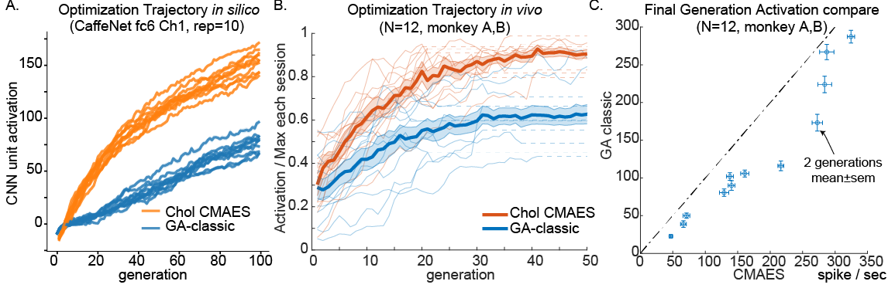
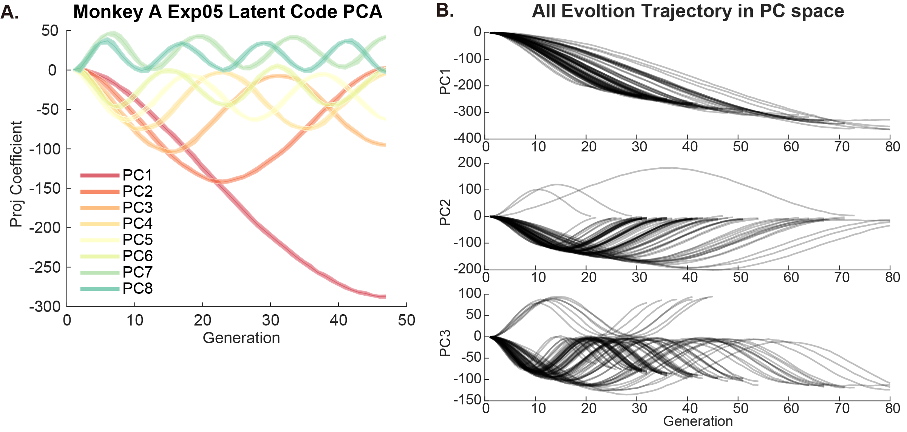

## Evolutionary Optimizer for Online Neuronal Control

This is the project page for testing and developing black box optimizers for searching for optimal images for neurons in artifical and biological neurons. 

## Rationale 
Activation maximization is a popular technique in CNN interpretability study: basically, it search for stimuli that maximize activation of a unit. Then these images that maximize response of a unit represent the coding content of the unit. 
In visual neuroscience, this philosophy has also been adopted for a while. Researchers can use online recording of neuronal response to [guide image search](https://www.sciencedirect.com/science/article/pii/S0092867419303915) and generate sketches of face or eyes. 

We can treat the firing rate of a neuron as an objective function and use optimizers to maximize its firing rate. 
<!-- In recent years, has also become a popular tool for visual neuroscience. -->

$$
z^*=\arg\max_z f(G(z)), \; I^*=G(z^*)
$$

Needless to say, as an optimization problem, this is challenging in three aspects 

* Search dimensionality is high (e.g. $d=4096$ in the generator $G$)
* Function evaluation is highly noisy (single trial neuronal variability)
* Total function evaluation time is limited (the number of images that could be presented to the subject in a session is highly limited, e.g. $N<3000$)

Given this constraints, we are motivated to find an optimizer that perform well. 

## Large-scale Benchmark of Gradient Free Optimizers
We first conducted a large scale benchmark of common evolutionary optimizers in their ability to optimize stimuli for visually selective units. 

We used units from pre-trained CNNs as models of visual neuron. For these optimizers, each visual neuron or CNN unit form a different function over the image space, thus it's a different test function for the optimizer. 
We chose the classic and popular model [`AlexNet`](https://papers.nips.cc/paper/2012/hash/c399862d3b9d6b76c8436e924a68c45b-Abstract.html) and a deeper and adversarially trained model [`ResNet50-robust`](https://github.com/MadryLab/robustness) as benchmark. ResNet50-robust was chosen due to its relative light weight and its higher similarity to the visual representations in the brain (high rank on the [Brain-Score](https://www.brain-score.org/)).

We tested 12 gradient-free optimizers as implemented / interfaced by [`nevergrad`](https://github.com/facebookresearch/nevergrad): NGOpt, DE, TwoPointsDE, ES, CMA, RescaledCMA, DiagonalCMA, SQPCMA, PSO, OnePlusOne, TBPSA, and RandomSearch. 

We found that Covariance Matrix Adaptation Evolution Strategy (CMAES) and Diagonal CMAES are the top two algorithms in terms of the highest activation it achieved! We found the same result for units across models and layers that even with the default setting of hyperparameters!

### Benchmark Specific Type of CMAES Optimizer 

### Comparison with Previous Method Genetic Algorithm
Further, the CMA methods consistently out-performed GA in vivo and in silico. 

## Geometry of CMA Evolution 
Given this intriguing success of CMA type optimizer, we further analyzed the geometry of its evolution trajectory to gain insights! 

We found the following facts about CMA Evolution: 

* In a high dimensional space, the covariance matrix $C$ changed very little. At the end of the evolution, the covariance could be well approximated by identity $I$. 
* Viewed in the principal components space, the trajectories were sinusoidal curves well fit by Cosine waves. This property is related to a high dimensional random walk. 
* As a collection, the trajectories preferrentially travel within the top eigen dimensions of the underlying image manifold. 
* 

### Sinusoidal Structure 

### Evolution Trajectory Preferentially Travels in Informative Part of the Space. 

### Image Space Variance Decay Due to Increased Code Norm.

## Re-design CMA-ES Optimizer

### Support or Contact
Contact binxu_wang@hms.harvard.edu if you have more questions about our work!
