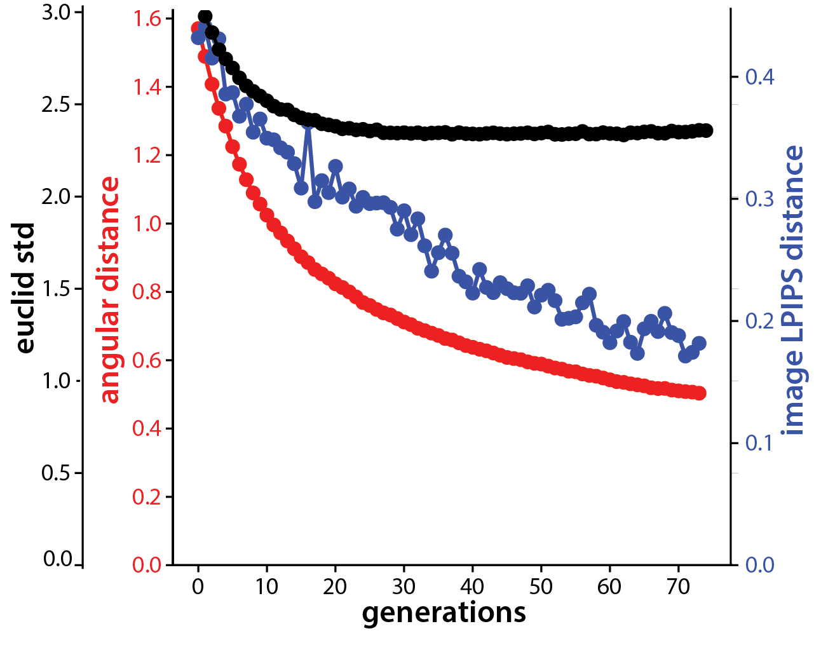

---
header-includes:
  - \usepackage{algorithm2e}
  - \usepackage{algorithm}
  - \usepackage{algpseudocode}
usemathjax: false
---
## Develop High-Performance Evolutionary Algorithms for Online Neuronal Control

## Rationale 

Activation maximization is a technique popularly used to interpret CNN units: basically, it search for images that maximize activation of the unit. Then these activation maximizing (ActMax) images could be interpreted as the coding content of the unit. 

In visual neuroscience, this philosophy has also been adopted for a while. Researchers can use online recording of neuronal response to [guide image search](https://www.sciencedirect.com/science/article/pii/S0092867419303915) and generate sketches of face or eyes. A recent implementation of this paradigm was [XDREAM](https://journals.plos.org/ploscompbiol/article/comments?id=10.1371/journal.pcbi.1007973). 

We can treat the firing rate of a neuron as an objective function and use optimizers to maximize its firing rate. 
<!-- In recent years, has also become a popular tool for visual neuroscience. -->

$$
z^*=\arg\max_z f(G(z)), \; I^*=G(z^*)
$$

Needless to say, as an optimization problem, this is challenging in three aspects 

* Search dimensionality is high (e.g. $d=4096$ in the generator $G$)
* Function evaluation is highly noisy (single trial neuronal variability)
* Total function evaluation time is limited (the number of images that could be presented to the subject in a session is highly limited, e.g. $N<3000$)

Given this constraints, we are motivated to find an optimizer that perform well. 

## Large-scale Benchmark of Gradient Free Optimizers
How to find competent optimizers for this problem? Comparing optimizers *in vivo* is hard and time consuming. So, we resorted to simulated neurons: CNN units. 

We conducted a large scale *in silico* optimizers "screening" using a set of benchmarks we design. We included units from two popular CNN models ([`AlexNet`](https://papers.nips.cc/paper/2012/hash/c399862d3b9d6b76c8436e924a68c45b-Abstract.html) and adversarially trained [`ResNet50-robust`](https://github.com/MadryLab/robustness)). From each model we included 5 different layers and for each unit we tested with three different noise level (no, low, high noise). Unlike normal black box optimization benchmark (BBOB) which aims at minimize, our functions need to be maximized and lack an obvious upper bound in its value. Thus we normalized the activation achieved by each optimizer by the empirical max for that unit. 

As for candidates, We first tested 12 gradient-free optimizers as implemented / interfaced by [`nevergrad`](https://github.com/facebookresearch/nevergrad): NGOpt, DE, TwoPointsDE, ES, CMA, RescaledCMA, DiagonalCMA, SQPCMA, PSO, OnePlusOne, TBPSA, and RandomSearch. 

<!-- We first conducted a large scale benchmark of common evolutionary optimizers in their ability to optimize stimuli for visually selective units. 

We used units from pre-trained CNNs as models of visual neuron. For these optimizers, each visual neuron or CNN unit form a different function over the image space, thus it's a different test function for the optimizer. 
We chose the classic and popular model [`AlexNet`](https://papers.nips.cc/paper/2012/hash/c399862d3b9d6b76c8436e924a68c45b-Abstract.html) and a deeper and adversarially trained model [`ResNet50-robust`](https://github.com/MadryLab/robustness) as benchmark. ResNet50-robust was chosen due to its relative light weight and its higher similarity to the visual representations in the brain (high rank on the [Brain-Score](https://www.brain-score.org/)). -->

Surprisingly, we found that Covariance Matrix Adaptation Evolution Strategy (CMA-ES) and Diagonal CMAES really shined in this competition! In the following plot, you can see the normalized activations they achieved for each optimizer, and the maximizing image they each found for a given unit. 

 <!-- We found the same result for units across models and layers that even with the default setting of hyperparameters! -->

Here you can see the optimization traces: achieved activation as a function of image presentation ; or as a function of generations. Given the same final activation, the larger area below the optimization trace the better, since that represents a faster convergence to highly activating images. 

<!-- 
 -->

<!--  -->

<!-- ### Benchmark Specific Type of CMAES Optimizer  -->

<!-- ### Comparison with Previous Method Genetic Algorithm -->
After another round between different variants of CMA algorithms, we chose Cholesky CMA-ES as our candidate. Finally, we tested out Cholesky CMA-ES *in vivo*! We found the CMA methods consistently out-performed GA *in vivo* and *in silico*. 

## Geometry of CMA Evolution 
So why CMA evolutionary strategy performed SO well? What mechanism made it suitable for our problem?

Our first hypothesis is its namesake, **Covariance Matrix Adaptation**, which can lead to clever steering strategy in the latent space. However, when we empirically evaluated the covariance matrix throughout evolution, we found that in a high dimensional space, the covariance matrix $C$ changed very little. At the end of the evolution, the covariance could still be well approximated by an identity matrix $I$. 

Thus we concluded that covariance matrix updates was not a reason for the success, and isotropic exploration could work through out the Evolution, this made the analysis and development of such algorithms much simpler.  

What else? Another hypothesis is its **step size tuning mechanism**. Just like in Deep Learning, the learning rate of parameters are usually turned down gradually. Here, the step size parameter also needs to be tuned properly. 

We noticed our generator space exhibits a spherical structure: The norm of a vector $$z$$ controls the contrast of the generated images; thus the perceptual distance between vectors were better approximated by their angle instead of the linear euclidean distance. 

Moreover, we noticed that the norm of the latent code increased proportional to the square root of generations $ \|z\|\propto \sqrt t$ , which is the classic property of diffusion or random walk. Due to the spherical geometry and the increased norm, even though the optimizer explored with the similar standard deviation in latent space, the image variation decreased consistently towards the end of the evolution. 

This intriguing interplay between random walk and geometry of the generative space induced this **automatic step size tuning mechanism**. We found it crucial for a good performance of the optimizer. 

<!-- Given this intriguing success of CMA type optimizer, we further analyzed the geometry of its evolution trajectory to gain insights!  -->

All in all, we found the following facts about CMA Evolution both *in vivo* and *in silico* (applied to CholeskyCMA and original CMA). 

* In a high dimensional space, the covariance matrix $$C$$ is updated negligibly. 
* The distance travelled in the latent space $$\|z-z_0\|$$ scaled as a square root of the generation number. $$\|z-z_0\|^2\propto t$$
* The variance among images in a generation decreases, due to the increasing vector norm and the decreasing sample standard deviation through out evolution. 
* When projected into the principal axis, the trajectories were sinusoidal curves well fit by Cosine waves. This property is related to a [high dimensional random walk](https://proceedings.neurips.cc/paper/2018/hash/7a576629fef88f3e636afd33b09e8289-Abstract.html). (Also see [my post](https://animadversio.github.io/academic_notes/pca-of-high-dimensional-trajectories) which explains the intriguing math behind)

* As a collection (across target units), the trajectories preferrentially travel within the top eigen dimensions of the underlying image manifold. Further, the distance travelled along each eigenvector statistically correlates with the (log) eigenvalue. 

<!-- ### Sinusoidal Structure  -->
<!-- ### Evolution Trajectory Preferentially Travels in Informative Part of the Space. 
### Image Space Variance Decay Due to Increased Code Norm.
 -->

## CMA Optimizer Re-designed
Given this understanding, we wanted to redesign the CMA algorithm that utilizes these principles. 

* We should search on a spherical shell in the latent space. The latent vectors used during GAN training were mostly sampled from the shell -- since high dimensional Gaussian variables have a highly consistant norm. 
* As the covariance matrix updates don't seem to help search, we make the optimizer explore isotropically on the sphere. 
* Specifically we sample with isotropic Gaussian in the tangent space and project these exploration vectors onto the sphere. 
* We need to build in a "manual" step size tuning mechanism, since the search is fixed on a sphere and the automatic tuning no longer happens. Here we make the angular step size decay as exponentially. 

Putting all of these together, we got our *de novo* Sphere CMA algorithm, the sampling and update procedure is visualized in this schematics. 

Surprisingly, this algorithm outperformed previous CMA algorithms *in silico*, esp. in low noise and noise-free scenario. 

### Contact
Contact binxu_wang@hms.harvard.edu if you have more questions about our work!
